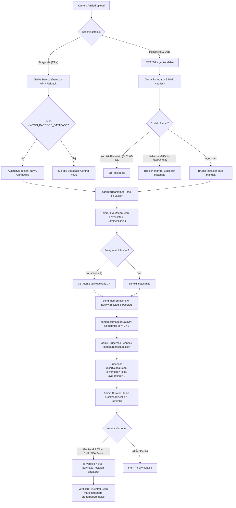

# 🗺️ FLOWBEAN – APPENS PROCESOVERBLIK & ARKITEKTURKORT

> **Dokumentstatus:** Aktivt Systemkort (Single Source of Architecture Truth)  
> **Gældende version:** v1.7.2 (Mobile Safe-Area Elevation, Spring Roll-Up Modals & Navigation Clearance)  
> **Formål:** Dette dokument fungerer som det overordnede arkitektur- og proceskort for hele Flowbean (tidligere Espresso Flow). Det skal konsulteres før enhver ny funktion eller ændring påbegyndes, og opdateres ved enhver strukturel tilføjelse for at forhindre regressioner, utilsigtede sideeffekter og systemsvagheder.

---

## 📑 INDHOLDSFORTEGNELSE
1. [Systemfilosofi & Nøgleprincipper](#1-systemfilosofi--nøgleprincipper)
2. [End-to-End Procesoverblik & Brugerrejser](#2-end-to-end-procesoverblik--brugerrejser)
3. [Computer Vision & Væskemekanisk Telemetrimotor](#3-computer-vision--væskemekanisk-telemetrimotor)
4. [Bønnescanning, Vivino-Matching & Kurator-Pipeline](#4-bønnescanning-vivino-matching--kurator-pipeline)
5. [Dataarkitektur & Local-First Synkronisering](#5-dataarkitektur--local-first-synkronisering)
6. [Komponenthierarki & State Ownership](#6-komponenthierarki--state-ownership)
7. [Konsekvensanalyse & Afhængighedsmatrix (Impact Map)](#7-konsekvensanalyse--afhængighedsmatrix-impact-map)
8. [Udviklingsrutine & Fejlsikring (Workflow Checklist)](#8-udviklingsrutine--fejlsikring-workflow-checklist)
9. [Nativ Mobil Container & TestFlight CI/CD (Capacitor v8 & Fastlane)](#9-nativ-mobil-container--testflight-cicd-capacitor-v8--fastlane)

---

## 1. SYSTEMFILOSOFI & NØGLEPRINCIPPER

Espresso Flow er bygget til at fungere fejlfrit i et krævende, virkeligt barmiljø:
- **Local-First & Offline-Autonom:** Alt fungerer 100% uden internetforbindelse. Skala-OCR, flow-beregninger, shot-logning og kværnkalibrering sker udelukkende på enheden.
- **Nul Bryg-Latens (< 5 ms):** Under et espresso-shot må der aldrig forekomme netværkskald, tunge re-renders eller UI-blokeringer. Computer vision-pipelinen kører direkte på canvas med fast 20–30 FPS uden memory leaks.
- **Matematisk Sandhed:** Flow rate beregnes som $F = \Delta Y / \Delta t$ med glidende 5-punkts moving average støjfiltrering. Kanalisering identificeres deterministisk ved pludselige flowspikes ($> 1.2 \text{ g/s}$).
- **Espresso Warmth Æstetik:** Varm Claude UI farvepalette (`#FAF7F2`, `#FFFDF9`, `#2C2018`, `#C26D52`) med `Courier Prime` monospace typografi, så realtids-vægttal aldrig "hopper" visuelt.
- **Forretningsmodel:** 7 dages fuld in-app prøveperiode efterfulgt af en engangsoplåsning på **$4.99 / 49,- DKK Lifetime Unlock** via RevenueCat.

---

## 2. END-TO-END PROCESOVERBLIK & BRUGERREJSER

Følgende Mermaid-procesdiagram illustrerer den samlede brugerrejse fra opstart og bønneforberedelse til brygning, smagsevaluering og kuratering:

```mermaid
flowchart TD
    %% Start & Onboarding
    Start([App Start]) --> CheckOnboarding{Onboarding udført?}
    CheckOnboarding -- Nej --> Onboarding[Onboarding Wizard<br/>Valg af maskine & kværn]
    Onboarding --> SaveGear[Gem primært bar-setup i LocalStorage]
    SaveGear --> Dashboard
    CheckOnboarding -- Ja --> Dashboard[Hovedskærm / Dashboard]

    %% Navigation
    Dashboard --> NavTabs{Vælg Navigation / Handling}
    
    %% Kaffevalg & Dial-In
    NavTabs -- Coffee Bar --> MethodChoice{Vælg Metode i Coffee Bar}
    MethodChoice -- ☕ Espresso Bar --> SelectEspresso[Espresso, Cortado, Flat White, Americano...]
    MethodChoice -- 🫗 Pour Over Bar --> SelectPourOver[V60 Standard, Chemex, Kalita Wave, AeroPress...]
    SelectEspresso --> SelectBean[Vælg Kaffebønne fra Beandex]
    SelectPourOver --> SelectBean
    SelectBean --> CheckFreshness[Vis Ristedato & Afgasningsgrad]
    CheckFreshness --> RecommendRatio[Beregn Dosis & Målyield / Vand ud fra Ristegrad & Metode]
    RecommendRatio --> SetTemp[Vælg Bryggetemperatur i °C el. °F]
    SetTemp --> ReadyToBrew[Klar til Brygning: Gå til Scale Cam]

    %% Bønnehåndtering / Beandex
    NavTabs -- Bønnesamling (Beandex) --> Beandex[Beandex Kaffehvælving]
    Beandex --> BeanActions{Handling i Beandex}
    BeanActions -- Scan Pose --> BagScanner[Bean Scanner Modal<br/>Stregkode + Etiket Vision OCR]
    BeanActions -- Manuel Oprettelse --> CreateBean[Opret Ny Bønne Formular<br/>Med Vivino-Autocomplete & Smagsnoter]
    BeanActions -- Udforsk Fællesskab --> CloudVault[Central Cloud Bean Vault Modal]
    BagScanner --> FuzzyCheck[Fuzzy Matcher: Undgå 'Coffee 3019'<br/>og 'Mente du...?']
    CreateBean --> FuzzyCheck
    CloudVault --> ImportBean[Importer verificeret bønne til lokalt arkiv]
    FuzzyCheck --> SaveLocalBean[Gem i LocalStorage: espresso_beans]

    %% Brygning & Telemetri
    ReadyToBrew --> ScaleCam[Scale Cam Monitor<br/>1:1 Uforvrænget Kamera-visning over vægtdisplay]
    NavTabs -- Scale Cam --> ScaleCam
    ScaleCam --> PreCalib{Før-Bryg Forberedelse}
    PreCalib -- Tryk på Vægten --> DynamicDelta[Dynamic Delta Auto-Kalibrering:<br/>Finger-tryk sporer vægt mod timer]
    PreCalib -- Focus Armor --> HardwareFocus[Hardware Focus Lock mod 50Hz pumpevibration]
    DynamicDelta --> FocusLocked[🎯 Vægt Låst & Fokuseret]
    HardwareFocus --> FocusLocked
    FocusLocked --> ModeSelect{Startmetode?}
    ModeSelect -- Manuel Start --> BaristaPress[Barista trykker Start Shot knap]
    ModeSelect -- Vægt-Trigger --> WeightDetect[Auto-start ved vægtstigning]
    BaristaPress --> OCRStream[Live OCR Computer Vision<br/>20-30 FPS aflæsning af tal (med 50Hz sub-pixel dæmpning)]
    WeightDetect --> OCRStream
    OCRStream --> ExtractionEngine[Ekstraktionsmotor: Beregn Flow Rate,<br/>Tid, Ratio & Kanaliseringsspikes]
    ExtractionEngine --> StopBrew{Stop Kriterium nået?}
    StopBrew -- Barista trykker Stop / Target Yield nået --> ShotFinished[Shot Afsluttet]

    %% Post-Shot Feedback
    ShotFinished --> SummaryModal[Immediate Post-Shot Summary Modal]
    SummaryModal --> SensoryRating[Sensorisk Smagsevaluering:<br/>Surt / Perfekt / Bittert & Stjerner]
    SensoryRating --> DialInAdvice[Intelligent Dial-In Rådgivning:<br/>Kværn finere / Kværn grovere / Juster ratio]
    DialInAdvice --> SaveShotLog[Gem ShotRecord i espresso_shots]

    %% Logbog & Historik
    NavTabs -- Logbog --> Logbook[Logbook Visning]
    SaveShotLog --> Logbook
    Logbook --> DailyTimeline[Dagsopdelt Tidslinje: Nyeste øverst]
    DailyTimeline --> ShotDetail[Fold-ud Shot Detaljer:<br/>Flowkurve, Kanaliseringsadvarsler, Noter]

    %% Admin & Kurator Studio
    NavTabs -- Curator Desk (#admin) --> CuratorGate{Pin / Passcode OK?}
    CuratorGate -- Ja (9246) --> CuratorStudio[Admin Coffee Curator Studio]
    CuratorGate -- Nej --> DenyPass[Adgang Nægtet]
    CuratorStudio --> CuratorTabs{Kurator Funktion}
    CuratorTabs -- Godkend Kaffer --> ReviewQueue[Godkendelseskø for scannede bønner]
    CuratorTabs -- SCA Score --> ScoreEditor[Tildel officiel SCA Cupping Score 0-100]
    CuratorTabs -- Tjekliste --> AuditChecklist[Månedlig Kurator Tjekliste & Audit]
    ReviewQueue --> SyncSupabase[Synkroniser til Supabase Central Vault]
    ScoreEditor --> SyncSupabase
```

---

## 3. COMPUTER VISION & VÆSKEMEKANISK TELEMETRIMOTOR

Kernen i Espresso Flow er den canvas-baserede computer vision motor, der aflæser en hvilken som helst digital espressovægts 7-segment display uden behov for Bluetooth eller specialvægte:

```mermaid
flowchart LR
    subgraph Vision Pipeline (Client-Side Canvas)
        Video[HTML5 Camera Stream] --> FrameGrab[Offscreen Canvas DrawFrame]
        FrameGrab --> CropROI[Crop til Region-of-Interest]
        CropROI --> AdaptiveThresh[Adaptiv Kontrast-Thresholding]
        AdaptiveThresh --> SegmentAnalysis[7-Segment Segmentering A-G]
        SegmentAnalysis --> DigitRecognition[Digit Recognition + Decimalkomma]
        DigitRecognition --> ConfidenceFilter{Confidence > 85%?}
        ConfidenceFilter -- Ja --> ValidWeight[Rå Vægt i gram: Y_i]
        ConfidenceFilter -- Nej --> DropNoise[Kasser fejlaflæsning]
    end

    subgraph Dynamics & Telemetri Engine
        ValidWeight --> NoiseFilter[Glidende Gennemsnit Moving Average N=5]
        NoiseFilter --> DiffCalc[Tidsdifferentiale: Flow Rate F = ΔY / Δt]
        DiffCalc --> SpikeDetector{ΔF > 1.2 g/s?}
        SpikeDetector -- Ja --> ChannelingAlert[Registrer Kanaliserings-Spike]
        SpikeDetector -- Nej --> SmoothCurve[Normal Ekstraktion]
        ChannelingAlert --> DataPoint[ShotDataPoint: time, weight, flow, isChanneling]
        SmoothCurve --> DataPoint
    end

    subgraph Live UI Render
        DataPoint --> LiveChart[HTML5 Canvas Flow Graph]
        DataPoint --> MonospaceDisplay[Courier Prime Stor Vægtvisning]
    end
```

### Kritiske Regler for Skala-Monitoren:
1. **Ryd altid op i `requestAnimationFrame`:** Afslutning af et shot eller navigation væk skal omgående stoppe render-loopet.
2. **Kamerastream release:** Ved unmount af `ScaleMonitor` skal alle `MediaStreamTrack.stop()` kaldes for at slukke telefonens kameradiode.
3. **Puck Resistance & Channelling:** Hvis flowet pludselig accelererer markant uden pumpeændring, markeres punktet med `isChanneling = true` og tælles i samlet shot-score.

---

## 4. BØNNESCANNING, VIVINO-MATCHING & KURATOR-PIPELINE

For at opnå en professionel Vivino-lignende oplevelse anvendes flertrins genkendelse og kvalitetssikring:



---

## 5. DATAARKITEKTUR & LOCAL-FIRST SYNKRONISERING

Espresso Flow anvender et **Local-First hybrid mønster**. Alt kan fungere uden netforbindelse, og data synkroniseres mod skyen, når forbindelsen er aktiv:

```mermaid
flowchart TD
    subgraph Klient (Mobil / Browser)
        subgraph LocalStorage (Single Source of Local Truth)
            LS_Shots[(espresso_shots)]
            LS_Beans[(espresso_beans)]
            LS_Grinders[(espresso_grinders)]
            LS_Access[(espresso_user_access)]
            LS_Temp[(espresso_temp_unit)]
            LS_DrinkGrinds[(espresso_drink_grinds)]
            LS_Checklist[(espresso_curator_checklist)]
        end

        subgraph In-Memory React State (App.tsx)
            State_ActiveBean[currentBean / activeBeanId]
            State_ActiveGrinder[currentGrinder / grinderName]
            State_ActiveDrink[activeDrinkId]
            State_TempUnit[tempUnit: C / F]
            State_Access[accessState: Trial / Pro]
        end
    end

    subgraph Backend Cloud (Supabase PostgreSQL)
        subgraph Cloud Vault Tables
            SB_Beans[(global_coffee_beans)]
            SB_Ratings[(bean_drink_ratings)]
        end
        subgraph Cloud Security
            RLS[Row Level Security: SELECT, INSERT, UPDATE, DELETE]
        end
    end

    %% Forbindelser
    LS_Shots <--> In-Memory React State
    LS_Beans <--> In-Memory React State
    LS_Grinders <--> In-Memory React State
    LS_Access <--> In-Memory React State

    In-Memory React State -- Offline Fallback ved opstart --> LS_Beans
    LS_Beans -- Asynkron Sync ved oprettelse --> SB_Beans
    SB_Beans -- Hent Verificerede Kaffer --> In-Memory React State
    SB_Beans <--> RLS
```

### Oversigt over Supabase Cloud Tabeller:
| Tabel | Nøglefelter | Beskrivelse & Sikkerhed |
| :--- | :--- | :--- |
| `global_coffee_beans` | `barcode` (PK), `name`, `roaster`, `roast_level`, `origin_country`, `suitable_for`, `flavor_notes`, `avg_rating`, `ratings_count`, `verifications_count`, `is_verified`, `expert_score`, `expert_source`, `image_url` | Centralt bønnekatalog. Offentlig læsning, bruger-crowdsourcing (sanitiseret), kurator-verificering og sletning med RLS. |
| `bean_drink_ratings` | `id` (PK), `barcode` (FK), `user_fingerprint`, `rating` (1-5), `drink_type`, `brew_ratio`, `comment` | Barista-bedømmelser pr. drikketype (Pure Espresso, Flat White, Cortado) med automatisk 70% konsensus-aggregering. |

### Oversigt over Nøgler i LocalStorage:
| Nøgle | Type / Model | Beskrivelse |
| :--- | :--- | :--- |
| `espresso_shots` | `ShotRecord[]` | Alle gennemførte espresso-shots med telemetripunkter og smagsrating. |
| `espresso_beans` | `CoffeeBeanProfile[]` | Baristaens personlige bønnekartotek (Beandex) inkl. posefotos og smagsnoter. |
| `espresso_grinders` | `GrinderProfile[]` | Baristaens kværn-flåde (trindelt / trinløs, aktiv kværn). |
| `espresso_user_access` | `UserAccessState` | Status for 7 dages prøveperiode eller Lifetime Pro oplåsning. |
| `espresso_temp_unit` | `'C' \| 'F'` | Valgt måleenhed for temperatur (Celsius / Fahrenheit). |
| `espresso_drink_grinds` | `Record<string, string>` | Husket kværnindstilling pr. kaffebønne og drikketype (`beanId_drinkId`). |
| `espresso_curator_checklist` | `Record<string, boolean>` | Kuratorens afkrydsede periodiske kvalitetstjek. |
| `espresso_last_curator_audit` | `string (YYYY-MM-DD)` | Dato for senest gennemførte officielle kurator-revision. |

---

## 6. KOMPONENTHIERARKI & STATE OWNERSHIP

Diagrammet nedenfor viser ejerskab af React state og fordeling af visninger:

```mermaid
graph TD
    App[App.tsx<br/>Master State Controller]
    
    %% Hovedvisninger (Styres af 5-faners Mobile Bottom Nav på mobil / Desktop Header Bar)
    App --> DrinkTab[DrinkSelector.tsx<br/>Barista Deck & Espresso/Pour Over Toggle]
    App --> MonitorTab[ScaleMonitor.tsx<br/>Live Scale Cam, OCR, Bloom/Steep & Flowgraf]
    App --> BeandexTab[BeandexView.tsx<br/>Bønnekartotek, Vivino Smagsnoter, Fotos]
    App --> LogbookTab[Logbook.tsx<br/>Dagsopdelt historik, kurver & smag]
    App --> GearTab[GrinderFleet / Gear Setup<br/>Kværn-flåde & baropsætning]
    App --> AdminTab[AdminPortal.tsx<br/>Curator Studio & Godkendelsespult]

    %% Ikoner & UI Assets
    App --> CustomIcons[CustomCoffeeIcons.tsx<br/>Professionelle Vector Line-Art Ikoner: CoffeeBean & Dripper]

    %% Modaler
    App --> DialInModal[DialInWizardModal.tsx<br/>Guidet dial-in, bønne- & drinkvalg, temp]
    App --> ScannerModal[BeanScannerModal.tsx<br/>Stregkode + Etiket OCR Scanner]
    App --> VaultModal[CentralBeanVaultModal.tsx<br/>Fællesskabs-katalog fra Supabase]
    App --> SummaryModal[ShotSummaryModal.tsx<br/>Post-shot evaluering & dial-in råd]
    App --> SettingsModal[SettingsModal.tsx<br/>Sprog, Enhed °C/°F, Pro & Kurator link]
    App --> PaywallModal[PaywallModal.tsx<br/>RevenueCat $4.99 Lifetime Unlock]
    App --> LegalModal[LegalModal.tsx<br/>Privacy Policy, Terms of Service, Support]

    %% Under-moduler
    MonitorTab --> OCR7Segment[ocr7segment.ts<br/>Computer Vision Core]
    MonitorTab --> MathLib[espressoMath.ts<br/>Moving Avg, Flow & Kanalisering]
    BeandexTab --> CatalogMatcher[beanCatalogMatcher.ts<br/>Fuzzy Matcher, Vivino Tags, Komprimering]
    AdminTab --> SupabaseLib[supabase.ts<br/>Cloud API, Verificering & Kuratering]
```



---

## 7. KONSEKVENSANALYSE & AFHÆNGIGHEDSMATRIX (IMPACT MAP)

Før der foretages ændringer i en kernekomponent, skal tabellen herunder konsulteres for at identificere afhængigheder:

| Ændret Fil / Model | Direkte Berørte Komponenter | Risiko & Opmærksomhedspunkter |
| :--- | :--- | :--- |
| **`src/types/espresso.ts`**<br/>(`CoffeeBeanProfile`, `ShotRecord`) | `App.tsx`, `Logbook.tsx`, `ScaleMonitor.tsx`, `ShotSummaryModal.tsx`, `BeandexView.tsx`, `storage.ts` | **Høj:** Kræver bagudkompatibilitet i `storage.ts` (fallback for manglende felter som `flavorNotes`, `imageUrl` eller `brewTemp`). |
| **`src/lib/ocr7segment.ts`** | `ScaleMonitor.tsx` | **Kritisk:** Canvas dimensioner og hukommelsesallokering. Må aldrig lække memory i animation frames. |
| **`src/lib/espressoMath.ts`** | `ScaleMonitor.tsx`, `Logbook.tsx`, `ShotSummaryModal.tsx` | **Høj:** Matematisk ensartethed. Flow rate formler, ratio-beregninger og kanaliseringstærskler må ikke afvige mellem live visning og historik. |
| **`src/lib/beanCatalogMatcher.ts`** | `BeandexView.tsx`, `BeanScannerModal.tsx`, `AdminPortal.tsx`, `DialInWizardModal.tsx` | **Mellem:** Ændring i smagspiller eller risterier skal bevare eksisterende gemte tags i `localStorage`. |
| **`src/lib/supabase.ts`** | `AdminPortal.tsx`, `CentralBeanVaultModal.tsx`, `BeanScannerModal.tsx` | **Mellem:** Offline fallback skal altid returnere data uden at kaste uhåndterede exceptions ved manglende internetforbindelse. |
| **`src/components/AdminPortal.tsx`** | `App.tsx`, `SettingsModal.tsx`, `BeandexView.tsx` | **Lav:** Router via URL hash (`#admin`). Skal altid rydde hash ved tilbagetastning for at undgå loop. |

---

## 8. UDVIKLINGSRUTINE & FEJLSIKRING (WORKFLOW CHECKLIST)

Når du ("Anti") eller en anden udvikler skal implementere en ny funktion eller rette en fejl, SKAL denne 4-trins rutine følges slavisk:

### Trin 1: Pre-Flight Arkitekturtjek
- [ ] Åbn `ARCHITECTURE.md` og gennemgå [Konsekvensanalyse-matrixen](#7-konsekvensanalyse--afhængighedsmatrix-impact-map).
- [ ] Bekræft, at den planlagte ændring ikke bryder Local-First princippet eller introducerer latency under brygning.
- [ ] Kontroller, om nye tekststrenge skal registreres i `src/i18n/locales/en.ts` som Single Source of Truth.

### Trin 2: Implementering med Sikkerhedsprincipper
- [ ] **Aldrig gør koden mindre:** Bevar alle eksisterende funktioner, interfaces og typer intakte.
- [ ] **Ryd op i ressourcer:** Alle event listeners, video tracks og animation frames skal afmeldes i `useEffect` cleanups.
- [ ] **Defensiv Data-Parsing:** Alle data fra `localStorage` eller kamera-OCR skal valideres med sikre fallbacks.

### Trin 3: Lokal Byggevalidering
- [ ] Kør `npm run build` i terminalen.
- [ ] Bekræft, at Vite og TypeScript compiler med **Exit Code 0** og nul typesnitfejl.

### Trin 4: Post-Flight Opdatering & Commit
- [ ] Opdater `ARCHITECTURE.md`, hvis nye komponenter, flows, ruter eller datastrukturer blev tilføjet.
- [ ] Forøg versionsnummer i `package.json` og dokumenter ændringen i `CHANGELOG.md` og `.agents/STATUS.md`.
- [ ] Commit og push til `origin main`.

---

## 9. NATIV MOBIL CONTAINER & TESTFLIGHT CI/CD (CAPACITOR V8 & FASTLANE)

Espresso Flow er pakket som en cross-platform mobilapplikation via Capacitor v8 med direkte integration mod iOS TestFlight og Google Play.

### 9.1 Hardware- og Platformarkitektur
| Komponent | Implementering | Formål & Beskyttelse |
| :--- | :--- | :--- |
| **Målplatform** | `TARGETED_DEVICE_FAMILY = 1` | iPhone-only initial udrulning. Låst til Portrait i `Info.plist` for at undgå uønsket rotation under brygning. |
| **Kamera & Optisk Zoom** | WebRTC `getUserMedia` + Optisk ROI | 1.8x/2.5x digital/optisk forstørrelse forhindrer iPhone makro-linse-spring (< 15 cm) og tillader 25–35 cm bar-afstand. |
| **Dobbelt-Lags Vågelås (WakeLock)** | Swift `isIdleTimerDisabled` + Java `FLAG_KEEP_SCREEN_ON` + Web API | Forhindrer skærmen i at dæmpe eller låse midt under et 30s espresso-shot på ALLE iOS-versioner (iOS 13–18+) samt Android og Web. |
| **Safe Area Insets** | `pt-safe`, `pb-safe`, `env(safe-area-inset-*)` | Sikrer at headers ikke skæres af Dynamic Island/notch, og at toasts svæver frit over iOS home-baren. |
| **100% Lokale Skrifttyper** | `public/fonts/` (Courier Prime & Inter woff2) | Garanterer nul ciffer-jitter og lynhurtig opstart helt uden CDN-afhængighed ved koldstart offline. |
| **Taktil Haptik** | `@capacitor/haptics` | Giver øjeblikkelig fysisk feedback: Let klik ved Nul/Tare-lås, tungt klik ved Shot Start, advarselsvibration ved Kanalisering (>4.2 g/s), succesvibration ved Målyield. |
| **Adaptiv OCR Billedhastighed** | `ScaleMonitor.tsx` | 80 ms (~12.5 FPS) i standby/tare-søgning (forhindrer termisk throttling og batteridræn) $\rightarrow$ 33 ms (~30 FPS) under aktiv brygning for flydende væsketracking. |
| **Database RLS Sikkerhed** | `supabase/schema.sql` | Alle offentlige DELETE-rettigheder er fjernet. Uautoriseret opgradering af bønners verificeringsstatus er blokeret. |
| **Swift 6 & SPM Plugin Isolation** | `scripts/patch-capacitor-plugins.cjs` | Automatisk korrektion af `call.reject` $\rightarrow$ `call.errorHandler?(nil)` i Capacitor v8 Swift Package Manager moduler. |
| **Native Ikon- & Navne-Suite (Flowbean)** | `scripts/generate-assets.py` | 8-tegns displaynavn `Flowbean` forhindrer afkortning med prikker. iOS indeholder `ios-marketing` og universal 1024x1024 + iPhone opløsninger. Android indeholder adaptive mipmaps + `#2C2018` baggrund uden overstyrende vector-drawables. |

### 9.2 iOS TestFlight Byggepipeline (`.github/workflows/ios-build.yml`)
- **Byggemiljø:** `macos-15` (Apple Silicon M-series), Xcode `26.3`, Node `22.x LTS`, Ruby `3.3`.
- **App Identifier:** `com.mh.espressoflow`.
- **Apple Developer Team:** `39T28DB5D4` (Mh Tegnestue).
- **Fastlane Lane (`:beta`):** Opretter midlertidig isoleret CI Keychain, importerer `certificate.p12`, downloader officiel provisioning profil via App Store Connect API (`AuthKey_<ID>.p8`), kompilerer `.ipa` med manuel signing og uploader direkte til TestFlight uden ventetid.
